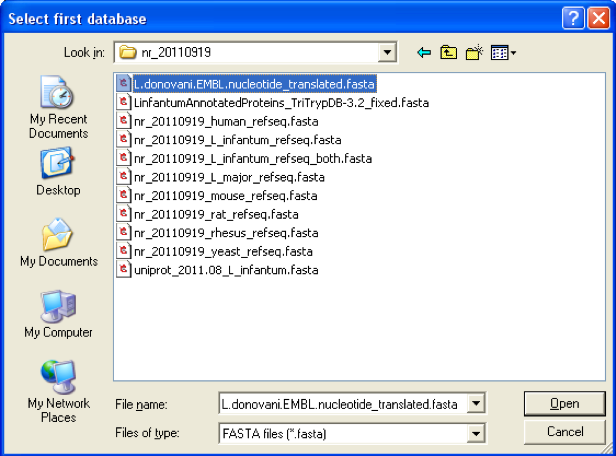
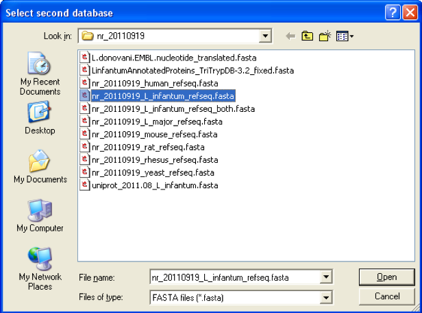
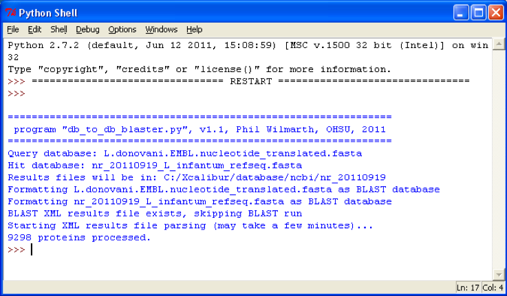

# PAW_BLAST
A utility for blasting one protein FASTA file (queries) against another (hits) to find orthologs (reciprocal best matches).

## Change Log

#### 20190619 - Minor update added some additional columns to the output table.

Added more columns with BLAST data so that more extensive table filtering can be done. This can be useful when trying to add as many ortholog annotations as possible. Adding annotations to FASTA files in one of the more common uses of this utility.

---

## What is this and Why would I use it:

The `db_to_db_blaster.py` script compares protein sequences from one FASTA protein database against another. It determines the reciprocal best matches (a basic ortholog definition). It uses a downloaded local installation of the NCBI BLAST program for the sequence comparisons. A tab-delimited text file of the matches is written to disk.

There are many uses of such a tool. The concept is to take a list of identified proteins from a proteomics experiment and create a subset FASTA file with just those sequences. The second FASTA database can be any of several things: identifications from another proteomics experiment (example: compare mouse eye lens proteins to human eye lens proteins), a better annotated related proteome (example: Leshmainia donovani IDs versus Leshmania infantum reference proteome), a reference proteome for a high quality model system (example: rat identifications versus a mouse Swiss-Prot reference proteome), a set of sequences from another publication (assuming that protein sequences in addition to the accessions can be obtained).

The text summary file includes both the accessions and descriptions from the target database, so this is an easy way to fetch protein descriptions from another source for poorly annotated protein databases. Some model systems have impressive annotations and others do not. Rat is poor compared to mouse. Monkey is poor compared to human. Rat and monkey should have considerable sequence similarity to mouse and human, respectively, so annotations from orthologs should be  informative and useful.

There is some computational overhead to running BLAST, hence the idea of using just a smaller list of identified proteins as the query FASTA database. Generally, a few thousand query sequences against 20K references sequences seems to work fine. There is a Word file (`BLASTer_guide.docx`) with more details on running the program and interpreting the output.

Creating the query FASTA database is up to the user. The formats of lists of protein identifications vary by search engine and there is the usual issue of protein groups. Generally, proteins that get grouped in most protein inference algorithms will have sequence similarity and picking one protein sequence to represent the group will be fine. Groups can also be expanded, but it is a little safer to use one representative. This is a reciprocal best match so lower protein redundancy tends to work better (both for the query database and the target database). One example script (`make_subset_DB_from_list_3.py`) for creating subset databases is included.

---

## Requirements

A local, stand-alone copy of NCBI BLAST program must be installed on the computer running `db_to_db_blaster.py`. The BLAST program is available for several platforms and downloadable installers are available at ftp://ftp.ncbi.nlm.nih.gov/blast/executables/blast+/LATEST/. Also [here](https://blast.ncbi.nlm.nih.gov/Blast.cgi?CMD=Web&PAGE_TYPE=BlastDocs&DOC_TYPE=Download).

There is a program variable called `blast_path` which needs to be set to the location where BLAST is installed on your computer. Check the source code for `blast_path` (it should be in a code block just after the `import` statements). The BLAST location depends on the computer platform. Change the appropriate path (Windows versus Mac/Linux) to match the location of BLAST on your computer.

The program requires a 3.X version of Python which can be obtained from www.python.org or from a scientific python distribution like [Anaconda](https://www.anaconda.com/distribution/). The program does not require any modules other than the standard libraries included in the main Python distribution.

## Running Python Scripts

The scripts can be launched in a few ways. The program’s icon can be double clicked on Windows systems. The program can be opened with IDLE, an integrated development environment included with the Python distributions. The Python distributions from www.python.org may set up context menus (right-clicking) to open python scripts with IDLE. Programs in IDLE are run using the F5 key or the “Run” menu. Anaconda has other integrated development environments ([Spyder](https://www.spyder-ide.org/) and [PyCharm](https://www.jetbrains.com/pycharm/)) that have their own ways to open and run scripts.  Python can also be executed from a command line with the script name (such as `db_to_db_blaster.py`) as the second parameter.

## Scripts and De-scrip-tions

- `make_subset_DB_from_list_3.py`
- `db_to_db_blaster.py`
- `annotate_from_BLAST-map.py`

`make_subset_DB_from_list_3.py` - Helper script to make subset FASTA files, typically from [PAW pipeline](https://github.com/pwilmart/PAW_pipeline) results files. The input is a plain text file with one protein accession per line. Matching sequences from a selected FASTA file are collected and written to a new FASTA file. If the list of accessions has been parsed to simplify/shorten, the script might work as expected. It tries to use an "in" test rather than an equality test for matching to (hopefully) include subset string matches. The results should be checked to see if some modification of the code to find matching accessions in the FASTA file may be needed. Clean subset string matching (not over-matching) can be tricky to achieve. This is a good reason not to alter accessions.

`db_to_db_blaster.py` - This is the main script that creates BLAST format sequence sets, runs BLAST locally, parses the results to find the reciprocal best matches, and writes a tab-delimited text summary file. More details are in subsequent sections below.

`annotate_from_BLAST-map.py` - This script modifies FASTA header lines to add some information from ortholog matches. This assumes that the databases have UniProt header lines. This is typically used to add annotations from a well-annotated species (human or mouse) to databases for less well-annotated species.

## `db_to_db_blaster.py` Overview

Program logic is simple. It takes every sequence in the first database (called the query database) and performs BLAST alignments to all proteins in a second database (called the hit database). The databases should be protein sequences in FASTA format. The databases will be converted to BLAST formatted files (3 files with extensions of “.phr”, “.pin”, and “.psq”). If those files exist, the database conversion is skipped to save time. Be warned that BLAST may not like valid FASTA characters such as stop codons (*) or gaps (-) and input databases may need to be processed to remove such characters. The BLAST run is saved in a (large) XML file and may take several hours to complete. If the XML file already exists, the BLAST run is skipped. If the BLAST run needs to be repeated make sure the XML file is deleted before running `db_to_db_blaster.py`. After the BLAST run has finished, the XML file is parsed and the top-matching hit protein for each query protein is reported in a tab-delimited text file that can be opened with Excel or any text editor. Details about the output file contents are given below.

## Program Execution
When the program starts, a dialog box will ask the user to browse to the first (query) database file:

The databases should be protein FASTA files. The second (hit) database does not have to be in the same location as the first database, however, the results files will be written to the folder containing the first database. After selecting the first database file, a second dialog box appears for selecting the second database:

Several lines of status information will be written to the console during program execution and a sample is shown below:

After program has finished the results files will be located in the same folder as the first database. The results files will be two files with “.xml” and “.txt” extensions. The filename will be a combination of the query and hit database names. The XML file is the full results from the BLAST run, including alignments and all hits per query. The TXT file is a tab-delimited summary of the top matches that shows query protein accession and description, top-matching hit accession and description, BLAST scores, and status information.

## Database Definitions

The reference database (the first database selected) is denoted as "query" and the database that is being BLASTed against (the second database selected) is denoted as "hit". The output file will have an entry for each protein in the query database. The highest scoring "hit" (top match) for a given query sequence is always reported unless there was nothing above some minimum e-value threshold that is specified in the blast call. The cutoff is pretty low, something like 10, but e-values depend on the size of the database and are calibrated for the 13.5 million sequence nr database not smaller single organism sequence databases. A status of "No_match" means that nothing was returned by BLAST.

## TXT File Column Keys

- **query_number** => sequential number of the proteins in the query database
- **query_acc** => the protein accession for the query sequence
- **query_desc** => the protein description string for the query sequence
- **hit_acc** => the accession for the best matching hit protein
- **hit_desc** => the protein description string for the best-matching hit sequence
- **blast_score** => a collection of information from the BLAST run (see below)
- **status** => classification of the match quality:
  - OK
  - Better_match
  - Partial_match_hit, Partial_match_query, Partial_match_both
  - Poor_match
  - No_match

## BLAST Scores

- **ident:X/Y** => number of identical amino acids (X) out of the total query length (Y).
- **pos:X/Y** => number of identical or similar amino acids, same definitions for X and Y.
- **hit:** => length (aa count) of hit sequence.
- **align:** => subset of hit that encompasses the alignment region (gaps, deletions, etc.).
- **bit:** => the BLAST bit score (an information content score, better than e-value for small databases).

These individual scores are also written to separate columns now. This can make it easier to filter the match results.

## Status Codes

If the alignment region length is less than half of the hit sequence length, the status will be **Partial_match_hit**. If the alignment region length is less than half of the query sequence length, the status will be **Partial_match_query**. If the alignment region length is less than half of the hit sequence length AND the alignment length is less than half of the query sequence length, the alignment is called **Partial_match_both**.

For all of the hit proteins, all bit scores for query matches are saved. If a query protein matches to a given hit protein but that hit protein matched to a different query protein with a higher bit score, then the match is called **Better_match**. If you search the "hit_acc" column for an accession associated with a "Better_match", you should find at least one different query protein (different row) where the bit score is higher. If there are gene duplications and such then there may be multiple matches with nearly the same bit scores.

The mean and standard deviation of percent identity scores are tabulated for all matches. If the identity is less than the mean identity minus one standard deviation, the match is called a **Poor_match**.

If no hits were above the BLAST e-value cutoff, then the status will be **No_match**.

The status will be **OK** when none of the above exceptions occur.
